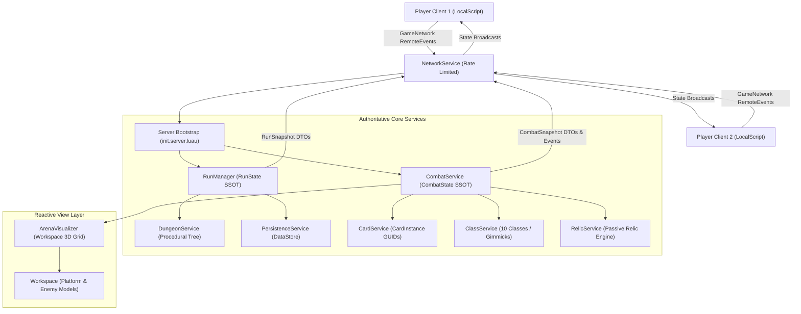
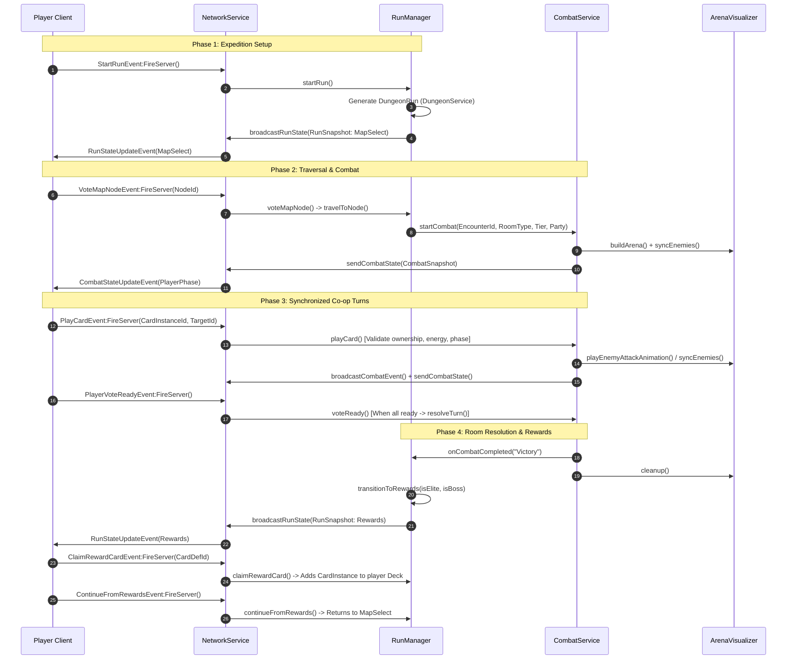

# CARD RIFT: CO-OP DUNGEON — ARCHITECTURE SPECIFICATION

## 1. Architectural Overview & Philosophy

*Card Rift: Co-op Dungeon* is a multiplayer roguelike deckbuilder built on the Roblox engine using strict Luau (`--!strict`). The runtime architecture is founded upon three inviolable principles:

1. **Single Source of Truth (SSOT)**: Every active dungeon run is owned by exactly one authoritative `RunState`, and every active combat encounter is owned by exactly one authoritative `CombatState`. Clients and visual scene instances are strictly reactive view layers.
2. **Deterministic Service-Oriented Lifecycle**: All server modules are managed as discrete services under `ServerScriptService.Server.services`. Services are initialized in strict dependency order via `init.server.luau` without using `_G` or asynchronous timing races.
3. **Exploit-Resistant Network Gateway**: All communication between clients and the server is routed through a single centralized gateway (`ReplicatedStorage.GameNetwork`) guarded by token-bucket category rate limiting. The server never trusts client-reported health, energy, card inventory, or damage figures.

---

## 2. High-Level System Architecture



---

## 3. Server Service Catalog & Boundaries

Each service operates with single responsibility and strict interface boundaries:

| Service Name | Path | Core Responsibility |
| :--- | :--- | :--- |
| **`NetworkService`** | `src/server/services/NetworkService.luau` | RemoteEvents owner (`ReplicatedStorage.GameNetwork`), category rate limiter (Combat 6/s, Map 3/s, Class 3/s, General 4/s), snapshot serializer/dispatcher. |
| **`PersistenceService`** | `src/server/services/PersistenceService.luau` | Permanent meta-progression profiles (Aether Shards, unlocked classes, lifetime run victories). Reconciles data with studio fallbacks. |
| **`CardService`** | `src/server/services/CardService.luau` | Runtime instance engine. Generates unique GUID `CardInstanceId`s from immutable `CardData` definitions. Manages deck shuffling, draw logic, and discard piles. |
| **`ClassService`** | `src/server/services/ClassService.luau` | Handles class & subclass selection, stat application, starting deck synthesis, and combat gimmick evaluation (Rage, Combo, Overload, Soul Harvest, etc.). |
| **`RelicService`** | `src/server/services/RelicService.luau` | Event-driven passive item triggers (`OnCombatStart`, `OnTurnStart`, `OnCardPlay`, `OnTurnEnd`, `OnDamageTaken`, `OnKill`). |
| **`DungeonService`** | `src/server/services/DungeonService.luau` | Wraps procedural 4-Act, 10-Tier dungeon generation, adjacency validation, and path traversal. |
| **`ArenaVisualizer`** | `src/server/services/ArenaVisualizer.luau` | Purely visual reactive layer. Builds 3D arena in Workspace, spawns physical enemy models with overhead BillboardGuis, and triggers attack/hit animations. |
| **`CombatService`** | `src/server/services/CombatService.luau` | Authoritative multi-enemy combat engine. Governs monotonic turn timers (`os.clock()`), `CardInstanceId` resolution, co-op scaling, ready voting, and teammate downed/revive states. |
| **`RunManager`** | `src/server/services/RunManager.luau` | Authoritative lifecycle engine for dungeon runs (`Lobby` $\to$ `MapSelect` $\to$ `ActiveRoom` $\to$ `Rewards` $\to$ `Victory`/`Defeat`). Coordinates party state and universal 3-card drafting. |

---

## 4. Single Source of Truth vs. Legacy Triple-State Divergence

Prior to Phase 1, state was split across three independent scripts communicating over `_G`:
- `GameCoordinator` maintained run flow and its own copy of player gold/decks.
- `SessionManager` maintained co-op party health, turn timers, and its own copy of enemy stats.
- `CombatServer` maintained 1v1 battle stats, cards in hand, and 3D models.

### How Phase 1 Solved This
1. **Consolidated State Owners**:
   - `RunState` is exclusively owned by `RunManager`.
   - `CombatState` is exclusively owned by `CombatService`.
2. **Definition vs. Instance Distinction**:
   - `CardData.Card` is an immutable definition table.
   - Cards in decks, hands, or piles are `CardInstance` objects carrying a unique `InstanceId` (e.g. `card_50123_4_f19a2b`). Players play cards referencing `CardInstanceId` rather than array indices, eliminating card duplication and race conditions.
3. **Multi-Enemy Support**:
   - Replaced singleton `currentBoss` with keyed table `Enemies: { [string]: EnemyState }`. The engine seamlessly handles 1 to $N$ active combatants per encounter.
4. **Decoupled View Layer**:
   - Workspace models and BillboardGuis are managed reactively by `ArenaVisualizer`. State does not rely on visual part existence or Roblox physics events.

---

## 5. Execution Flow & State Lifecycle



---

## 6. Deterministic Server Bootstrap Sequence

In `src/server/init.server.luau`, services are loaded and initialized strictly in order:

```luau
-- Deterministic bootstrap sequence:
NetworkService.init()       -- 1. Setup RemoteEvents and token-bucket buckets
PersistenceService.init()   -- 2. Connect DataStore lifecycle
CardService.init()          -- 3. Prepare instance generator
ClassService.init()         -- 4. Load class definitions & gimmick evaluators
RelicService.init()         -- 5. Prepare passive trigger registry
DungeonService.init()       -- 6. Verify procedural map rules
ArenaVisualizer.init()      -- 7. Build Workspace 3D platform & pedestals
CombatService.init()        -- 8. Mount multi-enemy combat engine
RunManager.init()           -- 9. Mount authoritative run coordinator
```

This ensures zero initialization deadlocks and zero reliance on arbitrary `task.wait()` delays.
