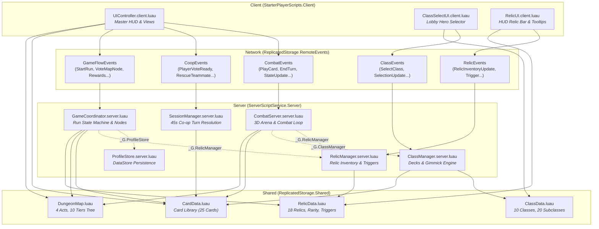
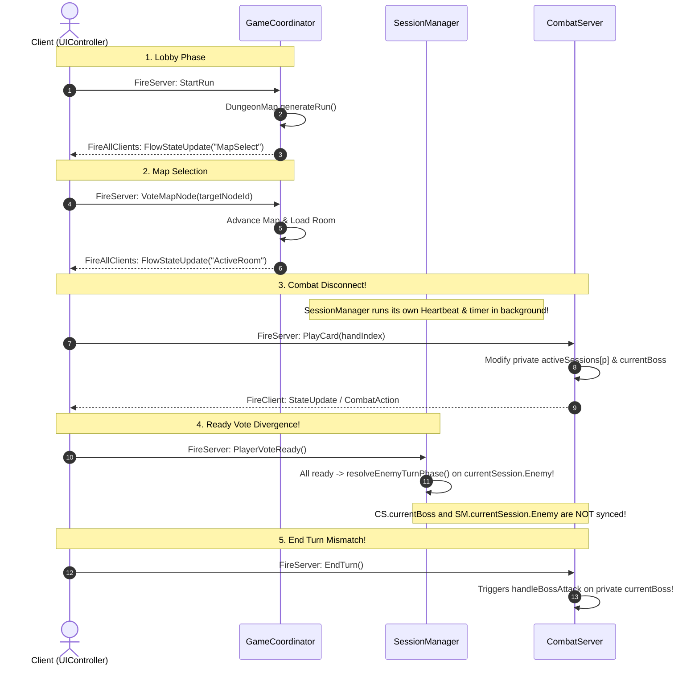

# Current System Map: Card Rift: Co-op Dungeon

This document outlines the operational structure, dependency graphs, state schemas, and network pathways of the active codebase.

---

## 1. System Dependency & Architecture Diagram

---

## 2. Existing State Schemas Comparison

The table below illustrates the fragmentation across the 3 main server systems:

### 2.1 Player State Representations

| Attribute | `CombatServer.PlayerCombatant` | `SessionManager.CoopPlayerState` | `GameCoordinator.PlayerRunData` | `ProfileStore.PlayerProfile` |
|---|---|---|---|---|
| **Key** | `Player` | `number` (UserId) | `number` (UserId) | `Player` |
| **Max HP** | `number` | `number` | *Missing* | *Missing* |
| **Current HP** | `number` | `number` | *Missing* | *Missing* |
| **Shield** | `number` | `number` | *Missing* | *Missing* |
| **Energy / Max**| `number` / `number` | `number` / `number` | *Missing* | *Missing* |
| **Poison** | `number` | *Missing* (on enemy only) | *Missing* | *Missing* |
| **Deck** | `{ Card }` | `{ Card }` | `{ Card }` | *Missing* |
| **Hand** | `{ Card }` | `{ Card }` | *Missing* | *Missing* |
| **Discard Pile**| `{ Card }` | `{ Card }` | *Missing* | *Missing* |
| **Turn Status** | `TurnNumber: number` | `IsReady: boolean`, `IsDowned: boolean` | `VotedNodeId: string?` | *Missing* |
| **Gold** | *Missing* | *Missing* | `Gold: number` | *Missing* |
| **Run Instance**| `DungeonRun: table` | *Missing* | *Managed at root* | *Missing* |
| **Meta-Currency**| *Missing* | *Missing* | *Missing* | `AetherShards: number` |
| **Victories** | *Missing* | *Missing* | *Missing* | `TotalVictories: number` |

---

### 2.2 Enemy State Representations

| Attribute | `CombatServer.BossCombatant` | `SessionManager.CoopEnemyState` | `GameCoordinator.ActiveRoomState` |
|---|---|---|---|
| **Storage** | Module-level singleton (`currentBoss`) | Session table (`currentSession.Enemy`) | Root coordinator (`coordinator.ActiveRoom`) |
| **Name** | `string` | `string` | `EnemyName: string?` |
| **Base HP** | *Missing* | `BaseHP: number` | *Missing* |
| **Max HP** | `number` | `MaxHP: number` (scaled) | `EnemyMaxHP: number?` |
| **Current HP** | `number` | `HP: number` | `EnemyHP: number?` |
| **Shield** | `number` | `number` | *Missing* |
| **Poison** | `number` | `number` | *Missing* |
| **Attack Power**| `number` | `AttackPower: number` | `EnemyAttack: number?` |
| **Intent** | Parsed in billboard string | `Intent: string` | *Missing* |
| **3D Model** | `Model?`, `BillboardGui?` | *Missing* | *Missing* |

---

### 2.3 Run & Session State Representations

| Attribute | `GameCoordinator.RunCoordinatorState` | `SessionManager.CoopSession` | `CombatServer` (Inline) |
|---|---|---|---|
| **Phase / State** | `"Lobby"` \| `"MapSelect"` \| `"ActiveRoom"` \| `"Rewards"` \| `"RunVictory"` \| `"RunDefeat"` | `"PlayerTurn"` \| `"EnemyResolution"` \| `"Victory"` \| `"Defeat"` | `session.InCombat: boolean` |
| **Dungeon Tree** | `DungeonRun: DungeonMap.DungeonRun?` | *Missing* | `session.DungeonRun` (duplicated per player) |
| **Turn Timer** | *Missing* | `TurnTimer: 45` | *Missing* (unlimited turn time) |
| **Ready Voting** | *Missing* | `areAllActivePlayersReady()` | *Missing* (solo-turn resolution) |
| **Room Controller**| Dynamically matches node type | Always assumes boss combat | Hardcoded 3D room types |
| **Reward Drafting**| 3 cards generated from pool | *Missing* | *Missing* |

---

## 3. Network Traffic & Control Flow

### Current Gameplay Sequence (Flow Divergence)

### Critical Flow Takeaway:
* `GameCoordinator` changes states, but `CombatServer` handles live card attacks, while `SessionManager` counts down a turn timer and runs an independent resolution loop.
* The client receives conflicting `StateUpdateEvent` (from `CombatServer`) and `CoopStateUpdateEvent` (from `SessionManager`).
