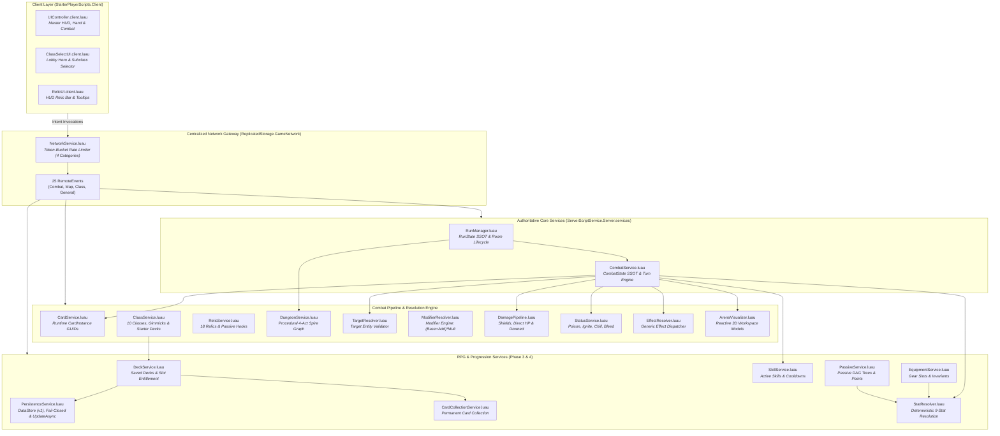

# Current System Map: Card Rift: Co-op Dungeon

**Current State**: Phase 4.1 Complete  
**Architecture**: Layered Service-Oriented Server, Centralized Network Gateway, Strict State Separation (`--!strict`).

---

## 1. System Architecture & Dependency Graph

---

## 2. Authoritative State Partitioning

The architecture enforces strict state boundaries between persistent account meta-data, run-scoped expedition state, and combat encounter state:

| State Domain | Owner Module | Storage Lifetime | Contents |
| :--- | :--- | :--- | :--- |
| **Account Profile** | `PersistenceService.luau` | Cross-session (Roblox DataStore `ProfileVersion = 1`) | `AetherShards`, `UnlockedClasses`, `CardCollection`, `Decks`, `ActiveDeckId`, `DeckSlotEntitlement`, `UnlockedSkills`. |
| **Permanent Collection** | `CardCollectionService.luau` | Account lifecycle | Dictionary of `{ [cardDefId]: number }` tracking permanent ownership counts. Never stores runtime instances. |
| **Saved Decks** | `DeckService.luau` | Account lifecycle | Dictionary of `SavedDeck`s referencing card definition IDs and counts. Server-generated GUIDs. |
| **Run State** | `RunManager.luau` | Expedition duration (Lobby to Victory/Defeat) | `PartyMembers: { [number]: PlayerState }`, `DungeonRun`, `CurrentAct`, `CurrentTier`, `ActiveNodeId`, `RunPhase`. |
| **Combat State** | `CombatService.luau` | Single room encounter | `Enemies: { [string]: EnemyState }`, `ActiveCombatants`, `TurnNumber`, `TurnTimer`, `TurnHistoryLog`, `Phase`. |
| **Runtime Cards** | `CardService.luau` | Expedition duration | `CardInstance` objects carrying unique runtime GUIDs in player `Deck`, `Hand`, `DiscardPile`, `ExhaustPile`. |
| **Visual Scene** | `ArenaVisualizer.luau` | Room encounter (Reactive only) | Workspace 3D platform, enemy `Model` instances, `BillboardGui`s, animations. Zero gameplay authority. |

---

## 3. Network Remote Catalog Summary

All network communication flows through `ReplicatedStorage.GameNetwork` managed by `NetworkService.luau`:

### Category Rate Limiters:
- **`Combat` (6 tokens max, 3.0/s refill)**: `PlayCard`, `PlayerVoteReady`, `RescueTeammate`, `UseSkill`.
- **`Map` (3 tokens max, 1.0/s refill)**: `VoteMapNode`.
- **`Class` (3 tokens max, 1.0/s refill)**: `SelectClass`.
- **`General` (4 tokens max, 2.0/s refill)**: `StartRun`, `ClaimRewardCard`, `ContinueFromRewards`, `RequestStateSync`, `EquipEquipment`, `UnequipEquipment`, `EquipSkill`, `UnequipSkill`, `UnlockPassive`, `CreateDeck`, `RenameDeck`, `DeleteDeck`, `SaveDeck`, `DuplicateDeck`, `SelectActiveDeck`, `RequestDecks`, `RequestCardCollection`.

### Core Security Principles:
1. **Server Injected Sender**: Sender identity is strictly derived from Roblox's authoritative `player.UserId`.
2. **Instance GUIDs**: Cards and equipment are referenced by runtime instance GUIDs validated against server state.
3. **Zero Minting Pathways**: Client cannot create persistent items, forge slot capacities, or authoritatively unlock skills.
4. **Fail-Closed Protection**: DataStore failures never write fallback starter data over existing player profiles.

