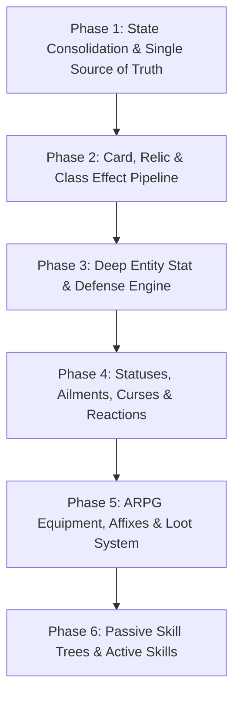

# Migration Plan: Moving to the ARPG Co-op Foundation

> [!NOTE]
> **Execution Status: Phases 1, 2, 3, 4 & 4.1 Completed & Fully Operational**  
> The migration from legacy monoliths to a unified, service-oriented architecture has been successfully executed.
> - **Phase 1 (1.0 – 1.2)**: Single Source of Truth architecture complete; legacy scripts removed.
> - **Phase 2 (2.0 – 2.4)**: Decoupled effect, modifier, and damage pipelines complete.
> - **Phase 3 (3.0 – 3.3)**: RPG foundation (Equipment, Passives DAG, Active Skills, StatResolver) complete.
> - **Phase 4 (4.0 – 4.1)**: Persistent account profile, CardCollectionService, DeckService, and fail-closed persistence complete.
> - **Verification Baseline**: 59 in-game integration suites, 608 verifier checks (100% pass).

---

## 1. Migration Principles
1. **Zero Blind Deletions**: Never remove working gameplay systems without a verified replacement running in parallel.
2. **Deterministic Module Architecture**: Replace disjoint `.server.luau` scripts relying on `_G` with strict Luau `ModuleScripts` loaded through a single server bootstrap (`init.server.luau`).
3. **Single Source of Truth**: All session, player, deck, enemy, and combat states must live in one authoritative container.
4. **Data-Driven Pipelines**: Eliminate hardcoded `if-elseif` ladders in favor of composable modifier pipelines.

---

## 2. Phased Roadmap

---

### Phase 1: State Consolidation & Single Source of Truth
**Goal:** Merge the fragmented responsibilities of `CombatServer`, `SessionManager`, and `GameCoordinator` into a unified service layer.

* **Step 1.1: Convert Scripts to Service Modules**
  * Convert `CombatServer`, `SessionManager`, `GameCoordinator`, `RelicManager`, and `ClassManager` into clean `ModuleScripts` under `src/server/services/`.
  * Create a single authoritative coordinator: `RunServiceController` or `DungeonService`.
* **Step 1.2: Unify State Containers**
  * Combine `PlayerCombatant`, `CoopPlayerState`, `PlayerRunData`, `PlayerProfile`, and `PlayerGimmickState` into a single canonical `PlayerState` object.
  * Combine `BossCombatant`, `CoopEnemyState`, and `ActiveRoomState` into an `EnemyCollection` supporting $N$ simultaneous enemies.
* **Step 1.3: Unify RemoteEvent Contracts**
  * Deprecate redundant events (`CombatEvents.SelectMapNode`, `CoopEvents.PlayCoopCard`).
  * Route all card actions through a single secure event: `CombatEvents.PlayCard(cardInstanceId, targetId?)`.
  * Pass card instance GUIDs instead of array indices to prevent hand shifting race conditions.
* **Validation Milestone:**
  * Clean Rojo build (`exit code 0`).
  * 1 to 4 players join, select classes in Lobby, vote on Map, enter Combat, and complete turns with a synchronized 45s timer and ready button.

---

### Phase 2: Decoupled Effect & Modifier Pipeline
**Goal:** Eliminate giant `if-elseif` ladders for Relics, Cards, and Class Gimmicks.

* **Step 2.1: Implement Composable Effect Handlers**
  * Build a standard `EffectContext` and `CombatPipeline`:
    * `PreCardPlay` $\rightarrow$ `EvaluateCost` $\rightarrow$ `CalculateDamage` $\rightarrow$ `OnDamageDealt` $\rightarrow$ `OnTurnEnd`.
  * Move hardcoded relic logic from `RelicManager` into self-contained behavior definitions.
* **Step 2.2: Universal Card Foundation**
  * Decouple cards from class restrictions. All basic and advanced cards become universal drops.
  * Classes provide starting deck preferences and passives rather than exclusive cards.
* **Validation Milestone:**
  * Adding a new relic or card requires zero modifications to existing manager scripts.

---

### Phase 3: Deep Entity Stat & Defense Engine (The PoE Core)
**Goal:** Implement multi-layered ARPG defenses and dynamic stat calculation.

* **Step 3.1: Multi-Pool Health & Defense Architecture**
  * **Life**: Base hit-point pool.
  * **Energy Shield (ES)**: Recharging protective buffer absorbing damage before Life (except Chaos/Void damage).
  * **Mana**: Resource pool consumed by Active Skills and Spells.
  * **Energy**: Turn-based action points for playing cards.
* **Step 3.2: Mitigation & Avoidance Layers**
  * **Armor**: Physical damage reduction formula: $\text{Reduction} = \frac{\text{Armor}}{\text{Armor} + 10 \times \text{Damage}}$.
  * **Evasion**: Entropy-based hit avoidance.
  * **Block & Spell Block**: Percentage chance to completely negate incoming attack or spell damage.
  * **Parry / Deflect**: Active timing or stance mitigation.
  * **Elemental Resistances**: Fire, Cold, Lightning, Chaos (capped at 75% baseline).
* **Step 3.3: Stat Calculation Pipeline**
  * Dynamic formula: $\text{Stat} = (\text{Base} + \sum \text{Flat}) \times (1 + \sum \text{Increased} - \sum \text{Reduced}) \times \prod (1 + \text{More}) \times \prod (1 - \text{Less})$.
* **Validation Milestone:**
  * Automated simulation scripts verify incoming attacks correctly pass through: Evasion $\rightarrow$ Block $\rightarrow$ Resistances $\rightarrow$ Armor $\rightarrow$ Energy Shield $\rightarrow$ Life.

---

### Phase 4: Ailments, Curses, Buffs, Debuffs & Reactions
**Goal:** Provide tactical status interaction between player abilities and enemies.

* **Step 4.1: Standardized Status Container**
  * Every entity has an active `StatusCollection`.
* **Step 4.2: Core Ailments & Curses**
  * **Ailments**: Ignite (Fire DoT), Chill/Freeze (action slowdown/stun), Shock (increased damage taken), Bleed (physical DoT), Poison (stacking chaos DoT).
  * **Charges**: Power (+Crit), Frenzy (+Speed/Damage), Endurance (+Resist/Armor).
  * **Curses**: Elemental Weakness, Vulnerability, Enfeeble.
* **Step 4.3: Elemental Reactions**
  * Combine statuses (e.g. Fire on Poison causes Explode; Cold on Shock causes Shatter).
* **Validation Milestone:**
  * Status ticks evaluate accurately on turn phases; reactions trigger floating combat alerts.

---

### Phase 5: ARPG Equipment, Affixes & Loot Engine
**Goal:** Implement gear drops with procedural affixes, rarity tiers, and granted skills.

* **Step 5.1: Item Data Schema & Equipment Slots**
  * Slots: Main Hand, Off-Hand/Shield, Helmet, Body Armor, Gloves, Boots, Amulet, Ring 1, Ring 2, Relic Slots (up to 4).
* **Step 5.2: Procedural Affix System**
  * Prefixes: Defense, Life, Flat Elemental Damage.
  * Suffixes: Resistances, Attack Speed, Critical Strike Chance, Attributes.
  * Tiers: Normal (White), Magic (Blue - 1 prefix/1 suffix), Rare (Yellow - up to 3 prefixes/3 suffixes), Unique (Orange - fixed game-altering passives).
* **Step 5.3: Loot Drop Table & Rewards Integration**
  * Elite monsters and Bosses drop gear that injects directly into player inventory and updates calculated stats upon equipping.

---

### Phase 6: Passive Skill Trees & Active Skills
**Goal:** Provide deep character build customization independent of cards.

* **Step 6.1: Passive Skill Graph**
  * Node types: Minor (+Stats/Resistances), Notable (+Key mechanics), Keystone (gameplay-altering rules e.g. *Chaos Inoculation*: Max Life becomes 1, Immune to Chaos damage).
  * Allocate points earned from leveling and boss victories.
* **Step 6.2: Active Skills (Non-Card Abilities)**
  * Separate hotbar for active skills (e.g. Dash, Warcry, Aether Ward) operating on cooldowns or mana rather than card energy.
* **Validation Milestone:**
  * Reallocating passive nodes dynamically recalculates stats on the fly without breaking active combat.
