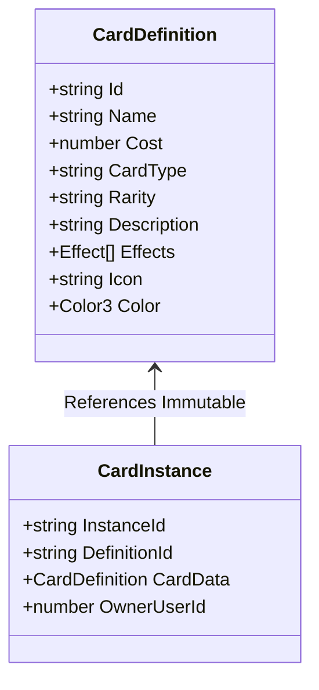

# CARD RIFT: CANONICAL STATE SCHEMA SPECIFICATION

**Version**: 4.1 (Phase 4.1 Hardened Baseline)  
**Strict Luau Definition**: [`src/shared/StateTypes.luau`](src/shared/StateTypes.luau)  

---

## 1. Overview

The *Card Rift* state architecture enforces a strict separation between:
1. **Canonical Authoritative State**: Internal data structures maintained exclusively by server services (`RunManager`, `CombatService`, `EquipmentService`, `SkillService`, `PassiveService`).
2. **Definition Data**: Read-only, immutable master definitions (`CardData`, `ClassData`, `RelicData`, `EquipmentData`, `SkillData`, `PassiveData`).
3. **Runtime Instances**: Dynamic, instantiated objects with unique GUIDs (`CardInstance`, `EquipmentInstance`, `SkillInstance`, `EnemyState`).
4. **Persistent Account Profile**: Cross-session player profile (`PlayerProfile`, `CardCollection`, `SavedDeck`, `DeckSlotEntitlement`, `ProfileLoadState`).
5. **Client View DTOs (Snapshots)**: Sanitized, serializable projections transmitted over the network to render client UIs.

---

## 2. Definition vs. Runtime Instance Models



### `CardInstance` Schema
```luau
export type CardInstance = {
    InstanceId: string,         -- Unique runtime GUID (e.g. "card_12345_1_a4f9b2")
    DefinitionId: string,       -- Reference to CardData ID (e.g. "Strike", "Defend")
    CardData: CardData.Card,    -- Immutable definition snapshot
    OwnerUserId: number,        -- Owner player's UserId
}
```

---

## 3. Authoritative Player State (`PlayerState`)

Every connected player in a run has an authoritative `PlayerState` record owned by `RunManager.PartyMembers`:

```luau
export type PlayerResources = {
    HP: number,
    MaxHP: number,
    Shield: number,
    Energy: number,
    MaxEnergy: number,
}

export type PlayerState = {
    UserId: number,
    PlayerInstance: Player?,
    DisplayName: string,
    ClassId: string,
    SubclassId: string,
    Resources: PlayerResources,
    Deck: { CardInstance },
    Hand: { [string]: CardInstance }, -- Keyed by CardInstanceId for O(1) safe lookup
    DiscardPile: { CardInstance },
    ExhaustPile: { CardInstance },
    RelicIds: { string },
    Gold: number,
    IsReady: boolean,
    IsDowned: boolean,
    IsConnected: boolean?,
    VotedNodeId: string?,
    -- Phase 3 Run-Scoped RPG Progression State
    EquippedItems: { [EquipmentSlot]: EquipmentInstance }?,
    EquipmentInventory: { EquipmentInstance }?,
    EquippedSkills: { [SkillSlot]: SkillInstance }?,
    SkillInventory: { SkillInstance }?,
    UnlockedSkills: { [string]: boolean }?,
    UnlockedPassives: { [string]: boolean }?,
    PassivePoints: number?,
}
```

---

## 4. Authoritative Multi-Enemy & Combat State (`CombatState`)

Combat supports simultaneous players and 1 to $N$ active enemies.

```luau
export type EnemyIntentType = "Attack" | "Defend" | "Buff" | "Debuff"

export type EnemyIntent = {
    Type: EnemyIntentType,
    Value: number,
    TargetUserId: number?,
    Description: string?,
}

export type EnemyState = {
    InstanceId: string,         -- Stable runtime identifier (e.g. "enemy_1", "elite_1")
    DefinitionId: string,       -- e.g. "SpireSentinel", "GremlinNob"
    Name: string,
    HP: number,
    MaxHP: number,
    Shield: number,
    Poison: number,
    AttackPower: number,
    Intent: EnemyIntent,
    ModelRef: Model?,           -- Optional Workspace representation
}

export type CombatPhase = "PlayerPhase" | "ResolutionPhase" | "Victory" | "Defeat"

export type CombatEvent = {
    Type: string,               -- "DamageDealt", "ShieldGained", "PlayerDowned", "PlayerRevived", etc.
    SourceId: string,
    TargetId: string,
    Value: number?,
    ExtraText: string?,
    Timestamp: number,          -- os.clock() monotonic timestamp
}

export type CombatState = {
    CombatId: string,
    Phase: CombatPhase,
    TurnNumber: number,
    TurnStartTime: number,      -- Monotonic timestamp via os.clock()
    TurnDuration: number,       -- 45 seconds standard
    Participants: { number },   -- UserIds of players in combat
    Enemies: { [string]: EnemyState }, -- Keyed by EnemyState.InstanceId
    ReadyPlayers: { [number]: boolean },
    CombatLog: { CombatEvent },
}
```

---

## 5. Authoritative Dungeon Run State (`RunState`)

The complete active dungeon progression state:

```luau
export type RunPhase =
    | "Lobby"
    | "MapSelect"
    | "ActiveRoom"
    | "Rewards"
    | "RunVictory"
    | "RunDefeat"

export type ActiveRoomType =
    | "Combat"
    | "Elite Monster"
    | "Campfire Rest"
    | "Merchant Shop"
    | "Act Boss"

export type ActiveRoom = {
    NodeId: string,
    Type: ActiveRoomType,
    Tier: number,
    ActIndex: number,
    RoomEncounterId: string?,
    CampfireUsed: boolean?,
    ShopVisited: boolean?,
}

export type RunRewards = {
    GoldAmount: number,
    AetherShardsAmount: number,
    OfferedCardsByPlayer: { [number]: { CardData.Card } }, -- 3 universal draft choices per player
    ClaimedCards: { [number]: boolean },
}

export type RunState = {
    RunId: string,
    Seed: number,
    Phase: RunPhase,
    ActIndex: number,
    CurrentTier: number,
    CurrentNodeId: string?,
    ClearedNodeIds: { string },
    AvailableNodeIds: { string },
    PartyMembers: { [number]: PlayerState }, -- Keyed by UserId
    ActiveRoom: ActiveRoom?,
    ActiveCombat: CombatState?,
    PendingRewards: RunRewards?,
}
```

---

## 6. Serializable Client View Snapshots (DTOs)

Snapshots sent over the network strip sensitive internal references (e.g. server `PlayerState`, full draw piles) and provide display-optimized structures:

### `CombatSnapshot`
```luau
export type CombatSnapshot = {
    CombatId: string,
    Phase: CombatPhase,
    TurnNumber: number,
    TurnStartTime: number,
    TurnDuration: number,
    TimeRemaining: number,              -- math.max(0, math.ceil(TurnDuration - (os.clock() - TurnStartTime)))
    Enemies: { [string]: EnemyView },  -- Keyed by Enemy InstanceId
    Party: { [string]: PlayerView },    -- Keyed by tostring(UserId)
    LocalHand: { CardView },            -- Only local player's hand
    CombatEvents: { CombatEvent },
    Message: string?,
}
```

### `RunSnapshot`
```luau
export type RunSnapshot = {
    RunId: string,
    Phase: RunPhase,
    ActIndex: number,
    ActName: string,
    CurrentTier: number,
    CurrentNodeId: string?,
    ClearedNodeIds: { string },
    AvailableNodeIds: { string },
    Party: { [string]: PlayerView },
    Rewards: {
        GoldAmount: number,
        AetherShardsAmount: number,
        OfferedCards: { CardView },
        HasClaimed: boolean,
    }?,
    Message: string?,
}
```

### `PlayerView`, `EnemyView`, `CardView`
```luau
export type PlayerView = {
    UserId: number,
    DisplayName: string,
    ClassId: string,
    SubclassId: string,
    HP: number,
    MaxHP: number,
    Shield: number,
    Energy: number,
    MaxEnergy: number,
    HandCount: number,
    DeckCount: number,
    DiscardCount: number,
    IsReady: boolean,
    IsDowned: boolean,
    Gold: number,
    RelicIds: { string },
}

export type EnemyView = {
    InstanceId: string,
    Name: string,
    HP: number,
    MaxHP: number,
    Shield: number,
    Poison: number,
    AttackPower: number,
    IntentText: string,
    IntentIcon: string,
}

export type CardView = {
    InstanceId: string,
    DefinitionId: string,
    Name: string,
    Cost: number,
    Description: string,
    Icon: string,
    Color: Color3,
}
```

---

## 7. Mathematical Formulas & Scaling

### 7.1 Co-op Health & Attack Scaling
To maintain balance across 1 to 4 players without bullet-sponge inflation:
$$\text{ScaledHP} = \text{round}\left(\text{BaseHP} \times \left(1 + 0.65 \times (\text{PlayerCount} - 1)\right)\right)$$
$$\text{ScaledAttack} = \text{round}\left(\text{BaseAttack} \times \left(1 + 0.20 \times (\text{PlayerCount} - 1)\right)\right)$$

### 7.2 Monotonic Turn Countdown
$$\text{TimeRemaining} = \max\left(0, \text{ceil}\left(\text{TurnDuration} - (\text{os.clock}() - \text{TurnStartTime})\right)\right)$$

### 7.3 Teammate Down & Revive
$$\text{RescueCost} = 2 \text{ Energy}$$
$$\text{ReviveHP} = \max\left(1, \lfloor\text{MaxHP} \times 0.25\rfloor\right)$$

---

## 8. Configuration Schema (`GameConfig.luau`)

Gameplay tuning constants and scaling thresholds are maintained in `ReplicatedStorage.Shared.GameConfig`:

```luau
GameConfig.Combat = {
    TurnDuration = 45,
    DefaultBaseHP = 100,
    DefaultStartingEnergy = 3,
    BaseHandDrawCount = 4,
    MaxTurnHistoryLog = 25,
}

GameConfig.Coop = {
    MaxPartySize = 4,
    MinPartySize = 1,
    RescueEnergyCost = 2,
    ReviveHpPercent = 0.25,
    EnemyHpScaleMultiplier = 0.65,
    EnemyAtkScaleMultiplier = 0.20,
}

GameConfig.Dungeon = {
    StarterGold = 50,
    CampfireHealPercent = 0.30,
}

GameConfig.Rewards = {
    BaseCombatGold = 25,
    BaseCombatShards = 5,
    EliteBonusGold = 25,
    EliteBonusShards = 5,
    BossBonusGold = 50,
    BossBonusShards = 15,
    CardDraftChoicesCount = 3,
}

GameConfig.NetworkLimits = {
    Combat = { MaxTokens = 6, RefillRate = 3.0 },
    Map = { MaxTokens = 3, RefillRate = 1.0 },
    Class = { MaxTokens = 3, RefillRate = 1.0 },
    General = { MaxTokens = 4, RefillRate = 2.0 },
}
```

---

## 9. RPG Character & Progression Schemas (Phase 3)

### 9.1 Equipment (`EquipmentInstance`)
```luau
export type EquipmentSlot = "Weapon" | "Armor" | "Accessory1" | "Accessory2"
export type EquipmentRarity = "Common" | "Uncommon" | "Rare" | "Epic" | "Legendary"

export type EquipmentInstance = {
    InstanceId: string,              -- Server-generated GUID (e.g. "equip_10001_1_a8f9")
    DefinitionId: string,            -- Reference to EquipmentData ID
    Slot: EquipmentSlot,             -- Canonical slot matching definition
    OwnerUserId: number,             -- Owner player's UserId
    Equipped: boolean,               -- Active equipped flag
}
```

### 9.2 Active Skills (`SkillInstance`)
```luau
export type SkillSlot = "Skill1" | "Skill2" | "Skill3" | "Skill4"

export type SkillInstance = {
    InstanceId: string,              -- Unique runtime GUID
    DefinitionId: string,            -- Reference to SkillData ID
    OwnerUserId: number,             -- Owner player's UserId
    CurrentCooldown: number,         -- Turns until ready (0 = available)
    Slot: SkillSlot?,                -- Slotted location
}
```

### 9.3 Centralized Stat Resolution (`ResolvedPlayerStats`)
```luau
export type ResolvedPlayerStats = {
    MaxHP: number,
    MaxEnergy: number,
    DamageMultiplier: number,
    BonusDamage: number,
    ShieldGainMultiplier: number,
    BonusShield: number,
    HealingMultiplier: number,
    BonusHealing: number,
    CostReduction: number,
    CritChance: number,
    CritMultiplier: number,
}
```

---

## 10. Persistent Account Profile & Deck Schemas (Phase 4 & 4.1)

### 10.1 Versioned Player Profile (`PlayerProfile`)
```luau
export type ProfileLoadState = "NotLoaded" | "Loaded" | "New" | "LoadFailed" | "Saving"

export type PlayerProfile = {
    ProfileVersion: number,                    -- Current schema: 1
    AetherShards: number,                      -- Meta currency earned from runs
    PremiumCurrency: number,                   -- Placeholder for future currency
    UnlockedClasses: { string },               -- Canonical unlocked HeroClass IDs
    TotalVictories: number,                    -- Lifetime run victories
    TotalRuns: number,                         -- Lifetime runs started
    LastSavedTimestamp: number,                -- os.time() of last persistence save
    CardCollection: { [string]: number },      -- Permanent CardDefinition ID -> Quantity owned
    Decks: { [string]: SavedDeck },            -- Keyed by server-generated DeckId
    ActiveDeckId: string?,                     -- Selected starting deck for runs
    DeckSlotEntitlement: DeckSlotEntitlement,  -- Configurable deck slot capacity
    UnlockedSkills: { [string]: boolean },     -- Account-wide unlocked skill IDs
    EquipmentCollection: { [string]: any },    -- Future equipment collection schema
    GachaBanners: { [string]: any },           -- Future banner/pity schema
}
```

### 10.2 Saved Deck & Slot Entitlement
```luau
export type SavedDeck = {
    DeckId: string,               -- Server-generated GUID (e.g. "deck_10001_172648_a8f9c2")
    Name: string,                 -- Player deck name (trimmed, 1 to 24 chars)
    Cards: { [string]: number },  -- CardDefinition ID -> Quantity (max 3 per card, 8-30 total)
    ClassId: string?,             -- Optional target class binding
    CreatedAt: number,            -- Timestamp created
    UpdatedAt: number,            -- Timestamp last edited
}

export type DeckSlotEntitlement = {
    BaseDeckSlots: number,        -- Base free slots (4)
    AdditionalDeckSlots: number,  -- Earned/purchased extra slots
}
```

